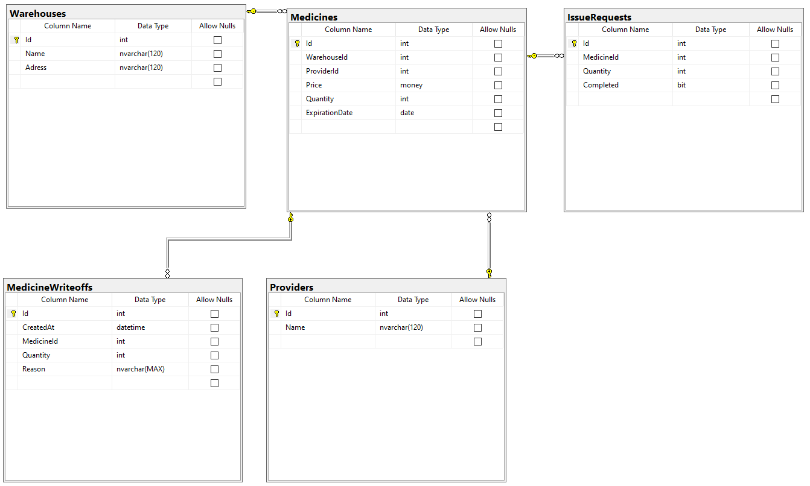

# WS 2024 APIs

## Репозиторий для подготовки к регионалке

### Проекты

- Session2 - API для первой части задания 2й сессии
- Session5 - API для мобилки в 5й сессии

### Разработка

1. Все проекты используют **.NET 7** с последними версиями пакетов:

- Microsoft.EntityFrameworkCore
- Microsoft.EntityFrameworkCore.Design
- Microsoft.EntityFrameworkCore.SqlServer
- Microsoft.EntityFrameworkCore.Tools
- Microsoft.VisualStudio.Web.CodeGeneration.Design

2. Разработка БД



3. Создание контекста БД

```bash
Scaffold-DbContext "Data Source=localhost;Initial Catalog=DbName;Integrated Security=True;TrustServerCertificate=True" Microsoft.EntityFrameworkCore.SqlServer -OutputDir Models/Db -force
```

### Как запустить

#### Session2

Выбрать в качестве стартового проекта и запустить

#### Session5

В **SSMS** запустить скрипт [session5.sql](./Scripts) и изменить строку подключения в контексте БД